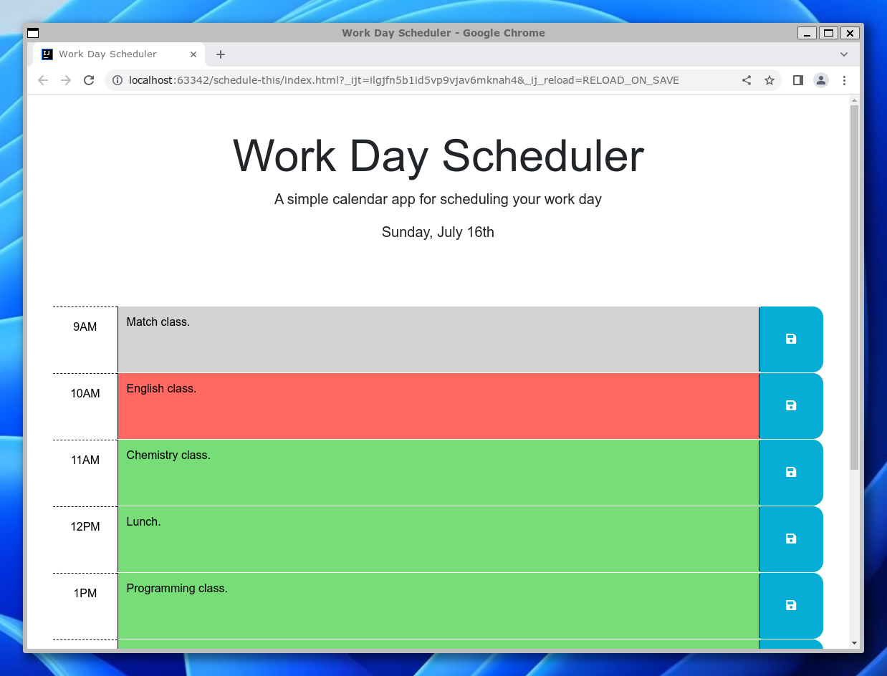

# Work Day Scheduler Starter Code

Schedule THIS!

This is the solution to the UC Berkeley Extensions coding boot camp module 5 challenge.
The challenge itself can be
found [here](https://courses.bootcampspot.com/courses/3826/assignments/57161?module_item_id=1005432)
and [here](https://git.bootcampcontent.com/University-of-California---Berkeley/UCB-VIRT-FSF-PT-06-2023-U-LOLC/-/tree/main/05-Third-Party-APIs/02-Challenge.)

## Table of Contents

- [About](#about)
- [Getting Started](#getting-started)
- [Installing](#installing)
- [Usage](#usage)
- [Docs](#docs)
- [Screenshot](#screenshot)
- [Contributing](#contributing)

## About

The purpose of this challenge is to familiarize the student with Third-Party APIs by finishing a Scheduler App
using the provided starter code. For example, jQuery and day.js.

## Getting Started

These instructions will get you a copy of the project up and running on your local machine for development and testing
purposes.

```bash
git clone git@github.com:srvidales/schedule-this.git
```

## Installing

No installation required for the App to work, but you can install nodejs to make use of eslint. 

## Usage

Open the [page](https://srvidales.github.io/quizzer/) in your favorite browser and create entries by clicking inside
the hour box, entering text and then clicking on the disk icon next to the box on the right. You can also remove an
entry by clicking on the hour box, clearing the text and saving. The entries will persist closing the browser since
they are saved to local storage and retried upload loading/reloading the app.

## Docs

Code documentation can be generated by running jsdoc on assets/js/script.js.

## Screenshot



## Contributing

- Sergio Vidales Perez <https://github.com/srvidales>
- Georgeyoo <https://github.com/Georgeyoo> (Starter code)
- Xandromus <https://github.com/Xandromus> (Starter code)
- Matt Fyke <https://github.com/mfyke> (Starter code)
- Courtney Mathena <https://github.com/courtthecoop> (Starter code)
